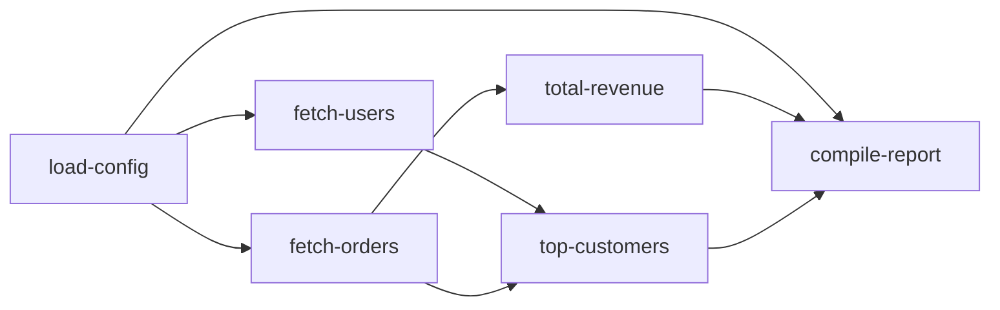

# Analytics Example

This scenario mimics a regional analytics job with multiple data sources and post-processing steps. It combines typed task results, hooks for logging, and a worker-pool dispatcher to orchestrate a richer DAG.

## How it works
- `load-config` seeds the pipeline with region and time range.
- `fetch-users` and `fetch-orders` depend on the config and simulate remote fetches.
- `total-revenue` aggregates the order totals, and `top-customers` correlates users with orders.
- `compile-report` gathers all previous outputs to produce a formatted report, while hooks log lifecycle events.

## Run it

```shell
go run .
```

## Task graph


