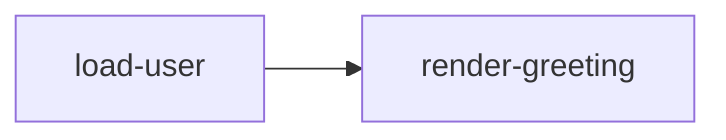

# Basic Example

This example builds the smallest useful `weave` graph: one task loads a user name and a dependent task renders a greeting. It demonstrates typed handles, dependency resolution, and synchronous execution with aggregated metrics.

## How it works
- `load-user` returns a mock user string.
- `render-greeting` depends on the previous task, fetches the user value, and formats the greeting.
- `graph.Run` executes the DAG and produces both the greeting and execution metrics.

## Run it

```shell
go run .
```

## Task graph


