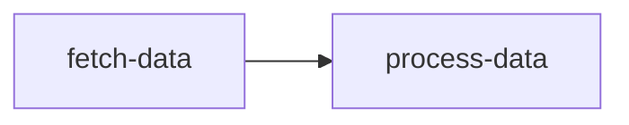

# Hooks Example

This sample adds lifecycle instrumentation to a two-node graph. Global hooks log when each task starts and finishes, while a per-task hook on `process-data` prints the final result.

## How it works
- `fetch-data` simulates a short fetch and returns a payload.
- `process-data` depends on the payload, transforms it, and emits a per-task `OnFinish` hook.
- `graph.Run` executes with `weave.WithGlobalHooks` so every task reports start/finish events.

## Run it

```shell
go run .
```

## Task graph


