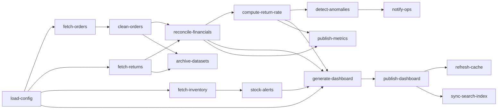

# Operations Example

This end-to-end scenario models a daily operations report for an online retailer. It pulls transactional data, reconciles revenue, evaluates inventory, generates dashboards, and reacts to anomalies. The graph uses custom hooks, rich metrics, a worker-pool dispatcher, and the `ContinueOnError` strategy so that downstream tasks keep running even when anomaly detection fails.

## Highlights
- **Global hooks** log every lifecycle event and feed a custom metric collector.
- **Worker pool dispatcher** (`weave.NewWorkerPoolDispatcher(4)`) keeps concurrency bounded while still parallelising independent branches.
- **Error strategy** (`weave.ContinueOnError`) lets publishing and archiving steps finish even if anomaly detection triggers a failure.
- **Metrics reporting** prints per-task durations, statuses, and aggregate execution stats at the end.

## Run it

```shell
go run .
```

## Task graph


