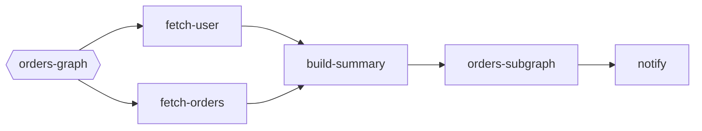

# Subgraph Example

Embed a reusable graph as a single task inside another pipeline with `weave.AddGraphTask`. This example wraps an orders subgraph that fetches customer data and builds a summary, then uses the result to send a notification from the parent graph.

## How it works
- `ordersGraph` defines `fetch-user`, `fetch-orders`, and `build-summary` tasks.
- `orders-subgraph` runs the subgraph inside the parent graph and returns the summary plus metrics.
- `notify` depends on the subgraph result and formats the final message.

## Run it

```shell
go run .
```

## Task graph


