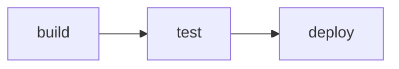

# Visualize Example

This example builds a three-stage CI-style pipeline and exports it to Graphviz DOT. Use it whenever you want to create documentation-ready diagrams from a `weave` graph.

## How it works
- `build` produces an artifact string.
- `test` depends on `build` and forwards the artifact.
- `deploy` relies on successful tests and reports the deployment string.
- `graph.ExportDOT` writes the DAG with a custom name and left-to-right layout.

## Run it

```shell
go run . > pipeline.dot
dot -Tpng pipeline.dot -o pipeline.png
```

## Task graph


