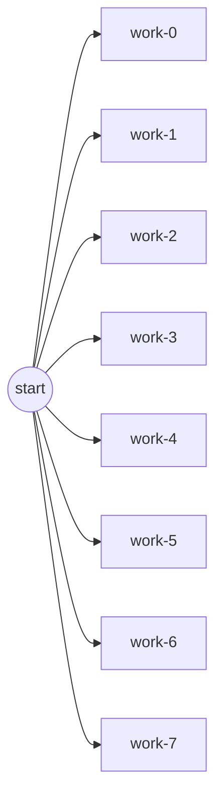

# Worker Pool Example

This program fans out eight independent tasks and executes them on a fixed-size worker pool dispatcher. It demonstrates how `weave` can bound concurrency while still collecting typed results and execution metrics.

## How it works
- `work-0` … `work-7` each simulate variable latency and return a computed integer.
- `graph.Start` runs the DAG asynchronously with `weave.NewWorkerPoolDispatcher(3)` to cap parallelism.
- `exec.Await` waits for completion, then each handle retrieves its result, and metrics reveal observed concurrency.

## Run it

```shell
go run .
```

## Task graph


