# Workflow Example

This example assembles a realistic daily content workflow by composing multiple `weave` graphs. The top-level graph orchestrates ingestion, curation, processing, quality, distribution, monitoring, and analytics stages, each implemented as a reusable subgraph. The processing stage nests additional pipelines (video, article, image), and those subgraphs embed their own specialised graphs (e.g. thumbnail generation → sprite sheet production), illustrating multi-level reuse. Downstream analytics fans back in by consuming outputs from several branches simultaneously.

## Highlights

- **Reusable subgraphs** – `AddGraphTask` wraps fully defined graphs so stages can be plugged together like tasks.
- **Nested composition** – video → thumbnail → variant/sprite graphs and regional rollout graphs demonstrate multi-level reuse.
- **Bounded concurrency** – each stage opts into its own worker pool configuration with `WithGraphTaskExecutorOptions`.
- **Rich data flow** – every branch returns structured summaries that the parent graph combines into a final daily report.
- **Cross-branch analytics** – the analytics stage spins up its own subgraph after ingesting outputs from curation, processing, quality, distribution, and monitoring.
- **Inline logging** – helper wrappers emit start/done (and failure) logs for every task and subgraph.

## Run it

```shell
go run .
```

## Full graph

```mermaid
flowchart TB
    %% Root configuration
    subgraph Root
        config[load-workflow-config]
    end

    %% Ingestion
    subgraph Ingestion
        ingest{{Ingestion graph}}
        loadCatalog[load-source-catalog]
        fetchOverrides[fetch-manual-overrides]
        fetchSchedule[fetch-schedule]
        merge[merge-schedule-with-overrides]
        normalize[normalize-sources]
        validateIngest[validate-ingestion]
        ingestSummary[ingestion-summary]
    end

    %% Curation
    subgraph Curation
        curate{{Curation graph}}
        loadCollections[load-collections]
        pickFeatured[pick-featured-candidates]
        tagEnrichment[tag-enrichment]
        validateCuration[validate-curation]
        curateSummary[curation-summary]
    end

    %% Processing
    subgraph Processing
        process{{Processing graph}}
        loadProcConfig[load-processing-config]
        planBatches[plan-batches]
        video{{video-pipeline}}
        article{{article-pipeline}}
        image{{image-pipeline}}
        videoBundle[video-bundle]
        articleSummary[summarise-articles]
        imagePublish[publish-image-bundle]
        qaChecks[run-quality-checks]
        processSummary[processing-summary]
    end

    %% Quality
    subgraph Quality
        quality[quality-stage]
        coverage[coverage-metrics]
        ingestWarn[ingestion-warnings]
        scanFailures[scan-failures]
        qualitySummary[quality-summary]
    end

    %% Distribution
    subgraph Distribution
        distribution{{Distribution graph}}
        loadPlan[load-distribution-plan]
        prewarm[prewarm-cdn]
        regional{{regional-rollout}}
        rollUSEast[rollout-us-east]
        rollEUWest[rollout-eu-west]
        rollAPSouth[rollout-ap-south]
        distSummary[distribution-summary]
    end

    %% Monitoring
    subgraph Monitoring
        monitor{{Monitoring graph}}
        collectMetrics[collect-metrics]
        updateDashboards[update-dashboards]
        incidentReview[incident-review]
        monitorSummary[monitoring-summary]
    end

    %% Analytics
    subgraph Analytics
        analytics[analytics-stage]
        aggregate[aggregate-metrics]
        derive[derive-highlights]
        risk[risk-assessment]
        analyticsSummary[analytics-summary]
    end

    %% Summary
    subgraph Summary
        summary[prepare-summary]
    end

    %% Edges
    config --> ingest
    ingest --> loadCatalog
    ingest --> fetchOverrides
    ingest --> fetchSchedule
    loadCatalog --> merge
    fetchOverrides --> merge
    fetchSchedule --> merge
    merge --> normalize --> validateIngest --> ingestSummary

    ingestSummary --> curate
    curate --> loadCollections
    loadCollections --> pickFeatured
    loadCollections --> tagEnrichment
    pickFeatured --> validateCuration
    tagEnrichment --> validateCuration
    validateCuration --> curateSummary

    ingestSummary --> process
    process --> loadProcConfig --> planBatches
    planBatches --> video
    planBatches --> article
    planBatches --> image
    video --> videoBundle
    article --> articleSummary
    image --> imagePublish
    videoBundle --> qaChecks
    articleSummary --> qaChecks
    imagePublish --> qaChecks
    qaChecks --> processSummary

    ingestSummary --> quality
    processSummary --> quality
    quality --> coverage
    quality --> ingestWarn
    coverage --> qualitySummary
    ingestWarn --> scanFailures --> qualitySummary

    processSummary --> distribution
    qualitySummary --> distribution
    distribution --> loadPlan --> regional
    loadPlan --> prewarm --> distSummary
    regional --> rollUSEast --> rollEUWest --> rollAPSouth --> distSummary

    distSummary --> monitor
    curateSummary --> monitor
    monitor --> collectMetrics --> updateDashboards --> incidentReview --> monitorSummary

    ingestSummary --> analytics
    processSummary --> analytics
    curateSummary --> analytics
    qualitySummary --> analytics
    distSummary --> analytics
    monitorSummary --> analytics
    analytics --> aggregate --> derive --> analyticsSummary
    aggregate --> analyticsSummary
    qualitySummary --> risk --> analyticsSummary
    monitorSummary --> risk

    ingestSummary --> summary
    processSummary --> summary
    curateSummary --> summary
    qualitySummary --> summary
    distSummary --> summary
    monitorSummary --> summary
    analyticsSummary --> summary
```


